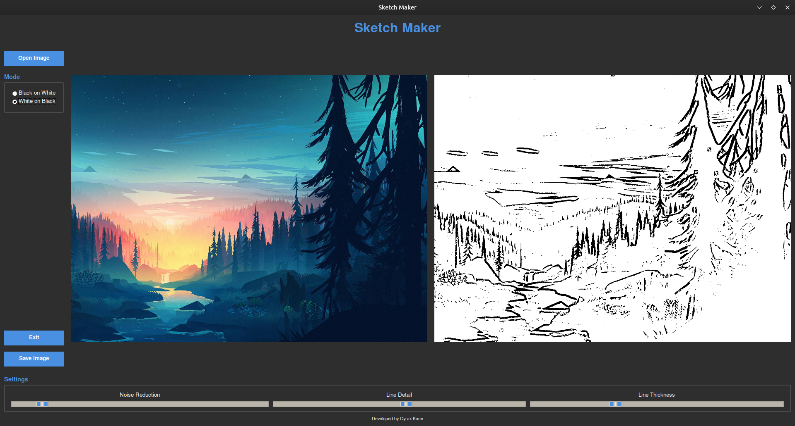

# Sketch Maker

Create beautiful line art from your photos with Sketch Maker! This desktop app instantly transforms images into black-on-white or white-on-black sketches. Fine-tune the look with real-time sliders for noise reduction, line detail, and thickness, then save your creation.



## Features

*   **Instant Sketch Conversion:** Transform any photo into a line drawing.
*   **Real-time Adjustments:** Use sliders to control noise reduction, line detail, and line thickness, and see the results immediately.
*   **Two Sketch Styles:** Choose between black lines on a white background or white lines on a black background.
*   **Interactive UI:** A modern, responsive user interface built with Python's Tkinter library.
*   **Open & Save:** Easily open images from your computer and save your finished sketches.

## Requirements

*   Python 3.x
*   OpenCV
*   Pillow (PIL)
*   NumPy

## Installation

1.  Ensure you have Python 3 installed on your system.
2.  Install the required libraries using pip:
    ```bash
    pip install opencv-python numpy Pillow
    ```

## Usage

To run the application, navigate to the project directory in your terminal and execute the following command:

```bash
python3 Sketch_Maker.py
```

## Controls

*   **Open Image:** Click to open a file dialog and select an image to convert.
*   **Mode:** Choose between "Black on White" or "White on Black" sketch styles.
*   **Settings Sliders:**
    *   **Noise Reduction:** Reduces noise in the original image for cleaner lines.
    *   **Line Detail:** Adjusts the level of detail captured in the sketch.
    *   **Line Thickness:** Controls the thickness of the lines in the final sketch.
*   **Save Image:** Click to open a dialog and save your creation.
*   **Exit:** Closes the application.

## Author

Developed by cyraxkane.

## License

This project is licensed under the GPL-3.0 License.
